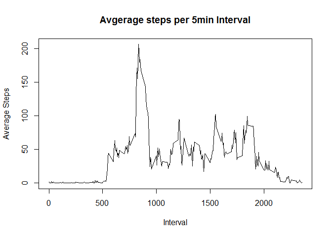

# Peer Assessment 1 for Reproducible Research
##Loading and preprocessing the data

1. Load the data:

```r
data <- read.csv("activity.csv")
```

##What is mean total number of steps taken per day?

1. Calculate the total number of steps taken per day


```r
aggdata <- aggregate(data$steps, by = list(data$date), FUN = sum, na.rm = TRUE)
```

2. Make a histogram of the total number of steps taken each day

```r
hist(aggdata$x, main = 'Number of Steps Taken Per Day', xlab = "Steps")
```

<!-- -->
  
3. Calculate and report the mean and median total number of steps taken per day

Mean:

```r
mean(aggdata$x)
```

```
## [1] 9354.23
```

Median:

```r
median(aggdata$x)
```

```
## [1] 10395
```

##What is the average daily activity pattern?

1. Make a time series plot (i.e. type = "l") of the 5-minute interval (x-axis) and the average number of steps taken, averaged across all days (y-axis)

```r
median(aggdata$x)
```

```
## [1] 10395
```

2. Which 5-minute interval, on average across all the days in the dataset, contains the maximum number of steps?

```r
median(aggdata$x)
```

```
## [1] 10395
```
##What is the average daily activity pattern?

1. Make a time series plot (i.e. type = "l") of the 5-minute interval (x-axis) and the average number of steps taken, averaged across all days (y-axis)

Calculate average steps per 5 minute interval:

```r
Stepinterval <- aggregate(steps~interval,data=data,mean,na.rm=TRUE)
```

Plot time series for the calculated steps per interval:

```r
with(Stepinterval, plot(interval, steps, xlab = "Interval", ylab = "Average Steps", main = "Avgerage steps per 5min Interval", type = "l"))
```

<!-- -->

2. Which 5-minute interval, on average across all the days in the dataset, contains the maximum number of steps?

```r
Stepinterval[which.max(Stepinterval$steps),]$interval
```

```
## [1] 835
```

##Imputing missing values

1. Calculate and report the total number of missing values in the dataset (i.e. the total number of rows with NAs)


```r
sum(is.na(data))
```

```
## [1] 2304
```

2. Devise a strategy for filling in all of the missing values in the dataset. The strategy does not need to be sophisticated. For example, you could use the mean/median for that day, or the mean for that 5-minute interval, etc.

Strategy: Fill missing data with the mean for that 5-minute interval.

New function to replace steps with average steps per interval:


```r
StepIntervalUpdate <- function(interval){Stepinterval[Stepinterval$interval == interval,]$steps}
```


3. Create a new dataset that is equal to the original dataset but with the missing data filled in.

Create a copy of the data to update the missing data:

```r
FilledData <- data
```

Loop to update the missing data:

```r
for (i in 1:nrow(FilledData)){
  if(is.na(FilledData[i,]$steps)){
    FilledData[i,]$steps <- StepIntervalUpdate(FilledData[i,]$interval)
    }
}
```

4. Make a histogram of the total number of steps taken each day and Calculate and report the mean and median total number of steps taken per day. Do these values differ from the estimates from the first part of the assignment? What is the impact of imputing missing data on the estimates of the total daily number of steps?

Total Steps per day:

```r
totalSteps2<-aggregate(steps~date,data=FilledData,sum)
```

Histogram:

```r
hist(totalSteps2$steps, main = "Total steps Per Day", xlab = "Steps")
```

<!-- -->

Mean:

```r
mean(totalSteps2$steps)
```

```
## [1] 10766.19
```

Median:

```r
median(totalSteps2$steps)
```

```
## [1] 10766.19
```

##Are there differences in activity patterns between weekdays and weekends?

1. Create a new factor variable in the dataset with two levels - "weekday" and "weekend" indicating whether a given date is a weekday or weekend day.

```r
FilledData$day=ifelse(as.POSIXlt(as.Date(FilledData$date))$wday%%6==0, "weekend","weekday")
```

2. Make a panel plot containing a time series plot (i.e. type = "l") of the 5-minute interval (x-axis) and the average number of steps taken, averaged across all weekday days or weekend days (y-axis). See the README file in the GitHub repository to see an example of what this plot should look like using simulated data.


```r
stepsInterval2=aggregate(steps~interval+day,FilledData,mean)
library(lattice)
xyplot(steps~interval|factor(day),data=stepsInterval2,aspect=1/2,type="l")
```

<!-- -->
